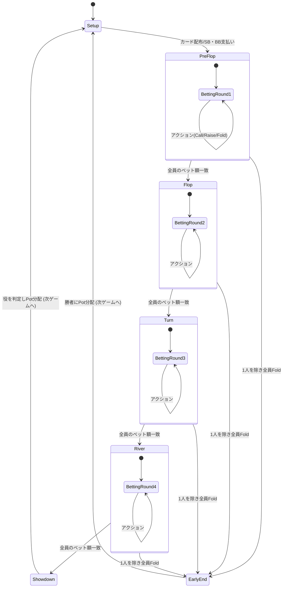
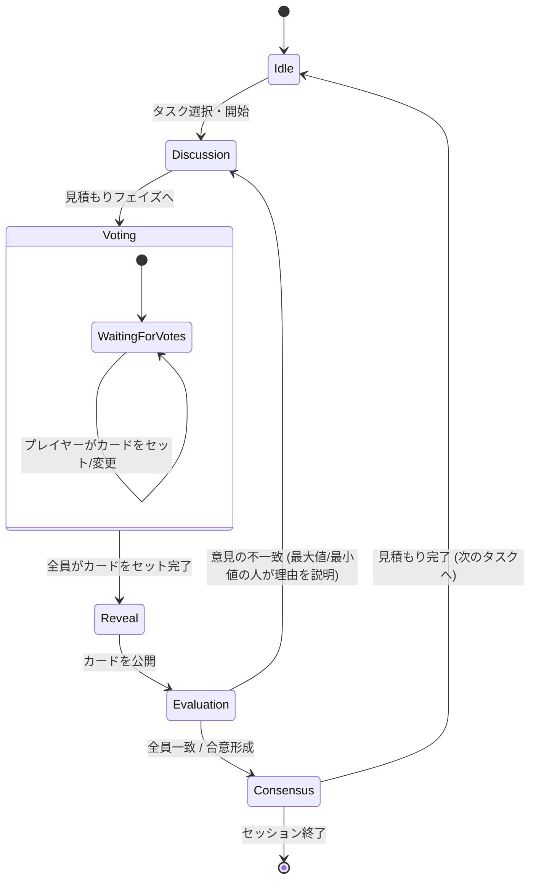
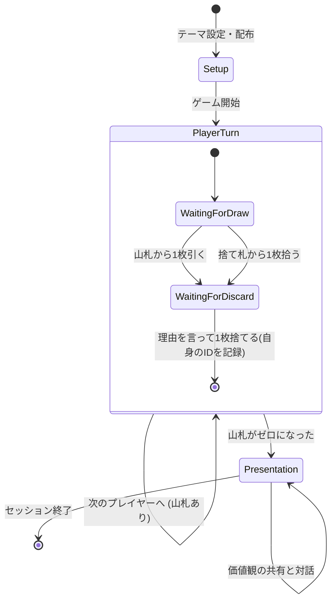
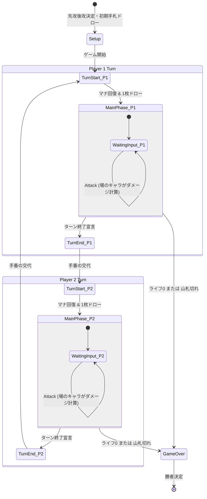

# Croupier: 汎用カードゲームエンジン設計書

あらゆるカードゲーム（TCG、ポーカー、ボードゲーム等）を「ステートマシン」として捉え、共通のエンジン上で動作させるための汎用フレームワーク**「Croupier（クルーピエ）」**のアーキテクチャ設計です。

Croupier（カジノの進行役・ディーラー）という名の通り、複雑なルールの進行や、プレイヤーに見せてはいけない情報の隠蔽（マスキング）を裏側で厳格に管理します。

---

## 1. コンセプト

本フレームワークは、**「ゲームエンジン（Croupier Core）」と「ゲーム定義（Game Definition）」**を完全に分離します。

開発者はエンジンそのものを書き換える必要はなく、用意されたインターフェースに従って「状態データ」「フェイズ構成」「処理関数」を定義してエンジンに渡すだけで、ゲームを構築できます。

- **状態駆動 (State-Driven):** ゲームの全情報は１つの巨大なJSONオブジェクト（Stateツリー）として保持されます。
- **単一方向データフロー:** プレイヤーの操作は Action（イベント）として発行され、定義された Reducer（処理関数）を通ってのみ State を更新します。
- **ステートマシン制御:** 現在の Phase（状態）によって、受け付ける Action や自動発生するイベントが制御されます。

---

## 2. 全体アーキテクチャ

システムは以下の主要コンポーネントで構成されます。

### 2.1. Croupier Core (エンジン本体)

フレームワークが提供する中核クラスです。

- State の保持と管理（サーバー側でマスターデータを保持）。
- Action のディスパッチ（受け付けと実行）。
- 現在の Phase に基づくアクションのバリデーション（不正な操作のブロック）。
- フェイズの遷移条件（Transitions）の監視と自動進行。
- クライアント送信前の状態隠蔽（State Masking）

### 2.2. Game Definition (ゲーム定義オブジェクト)

開発者が記述し、Croupierに注入する設定群です。以下の要素を含みます。

- **setup():** ゲーム開始時の初期状態（State）を生成する関数。
- **actions:** プレイヤーの操作に伴い State を変更する関数群（Reducers）。
- **phases:** ステートマシンの「ノード」の定義。各フェイズのルールを記述。
- **playerView():** （オプション）各プレイヤーに送信する状態をフィルタリングする関数。

---

## 3. インターフェース定義 (TypeScript風疑似コード)

開発者は以下のような `CroupierConfig` オブジェクトを定義してエンジンに渡します。

```typescript
interface CroupierConfig {
  // 1. 初期状態の生成
  setup: (numPlayers: number) => GameState;

  // 2. 状態更新関数群 (Reducers)
  actions: {
    [actionName: string]: (state: GameState, playerId: string, payload: any) => void;
  };

  // 3. フェイズとステートマシンの定義
  phases: {
    [phaseName: string]: {
      onEnter?: (state: GameState) => void;
      allowedActions: string[];
      transitionIf?: (state: GameState) => string | null;
      onExit?: (state: GameState) => void;
    };
  };

  // 4. ゲーム終了判定
  endIf?: (state: GameState) => any | null;

  // 5. 状態の隠蔽 (State Masking)
  // クライアントへ送信する直前に、そのプレイヤーが見てはいけない情報を消去・置換する
  playerView?: (state: GameState, playerId: string) => any;
}
```

---

## 4. 処理のフロー（ライフサイクル）

アクションが発生した際の、Croupier内部の処理フローです。

1. **イベント発火:** クライアントから `dispatch("PlayCard", { cardId: "C_123" })` が送信される。
2. **バリデーション:**
   - 現在の Phase の `allowedActions` に含まれているか確認。
   - `actions.PlayCard` 内で、ゲーム内ルールチェックを行う。
3. **状態更新 (Action実行):** `actions.PlayCard(state, payload)` を実行し、マスター State を更新する。
4. **終了判定:** `endIf(state)` を評価。勝敗が決まっていればゲーム終了。
5. **遷移判定・フェイズ進行:** `transitionIf` を評価し、条件を満たせば次のフェイズへ自動遷移。
6. **UI更新 (State Masking & Broadcast):**
   - Croupierは更新されたマスター State をそのまま送信しない。
   - 全プレイヤーに対して `playerView(state, playerId)` を実行し、各プレイヤー専用のサニタイズされた State（Client State） を生成する。
   - 生成した Client State を、対応する各クライアントへ個別に送信する。

---

## 5. 実装例：デジタルTCGを定義してみる

Croupierを使って「デジタルTCG」を構築する場合の設定例です。

```typescript
const DigitalTCG = {
  setup: () => ({
    turnCount: 0,
    activePlayer: "P1",
    players: {
      P1: { life: 20, mana: 0, maxMana: 0, deck: [...], hand: [], board: [] },
      P2: { life: 20, mana: 0, maxMana: 0, deck: [...], hand: [], board: [] }
    }
  }),

  actions: { /* 省略 */ },
  phases: { /* 省略 */ },
  endIf: (state) => { /* 省略 */ },

  // --- 状態隠蔽の定義 ---
  playerView: (state, requestPlayerId) => {
    // 1. マスターデータのディープコピーを作成（原本を汚さないため）
    const clientState = JSON.parse(JSON.stringify(state));

    // 2. 各プレイヤーの情報をチェックし、非公開情報をマスキングする
    Object.keys(clientState.players).forEach(pId => {
      const player = clientState.players[pId];

      // 山札(deck)の中身は全員見えないので、単純な「枚数(int)」に置換する
      player.deckCount = player.deck.length;
      delete player.deck;

      // 手札(hand)の隠蔽処理
      if (pId !== requestPlayerId) {
        // 相手プレイヤーの手札なら、中身を消して「裏向きのカードの配列」に置換する
        player.hand = player.hand.map(card => ({ id: "hidden_card" }));
      }
      // ※自分の手札(pId === requestPlayerId)の場合はそのまま送信される
    });

    return clientState;
  }
};

// Croupierエンジンの起動
// const engine = new CroupierCore(DigitalTCG);
```

---

## 6. 非公開情報の隠蔽（State Masking）の重要性

この `playerView`（サニタイザー）による隠蔽処理には、以下の利点があります。

### 完全なチート対策

クライアント側に物理的にデータが届かないため、どんなに高度な解析ツールを使っても相手の手札や次のドローカードを知ることは不可能です。

### 通信量の削減

巨大な山札（Deck）のオブジェクト配列を、単なる「残り枚数（`deckCount: 30`）」という整数値に変換して送るため、毎回の通信ペイロードが劇的に軽量化されます。

### 観戦機能への応用

`playerView` の `requestPlayerId` を「観戦者（Spectator）」として処理すれば、「両方の手札が見える状態」「両方とも見えない状態」など、ゲームロジックを変えずに柔軟なビューを提供できます。

---
---

# ゲーム設計1: テキサスホールデム ステートマシン設計図

テキサスホールデムのゲーム進行を、状態（State）、入力（Input/Event）、遷移（Transition）の観点からモデル化した設計図です。

---

## 1. 保持する状態（State Variables）

ゲームの進行に伴い、常に更新・参照されるデータ群です。

### グローバル状態（共有情報）

| 変数名 | 型 | 説明 |
|---|---|---|
| Pot | int | 現在賭けられているチップの総額 |
| CurrentHighestBet | int | 現在のラウンドにおける最高ベット額 |
| CommunityCards | Array\<Card\> | 場に出ている共通カード（最大5枚） |
| Deck | Array\<Card\> | 山札 |
| DealerPosition | int | ディーラーボタンを持つプレイヤーのインデックス |
| CurrentPlayerIndex | int | 現在アクションを求められているプレイヤー |

### プレイヤー状態（各プレイヤーが個別に保持）

| 変数名 | 型 | 説明 |
|---|---|---|
| Stack | int | 所持しているチップ残高 |
| HoleCards | Array\<Card\> | 手札（2枚） |
| CurrentBet | int | 現在のラウンドで既に賭けた額 |
| Status | enum | プレイヤーの現在の状態 |

**Status の値:**

- **Active:** プレイ続行中
- **Folded:** 降りた（非アクティブ）
- **AllIn:** 全チップを賭けた（アクションはスキップされるが権利は残る）

---

## 2. メインステート（フェイズの遷移）

ゲーム全体の進行を管理する大枠のステートマシンです。

| 現在の状態 | 発生する処理 | 遷移条件 (Event) | 次の状態 |
|---|---|---|---|
| **Setup** | デッキ初期化、ブラインド強制支払い、手札配布 | 準備完了 | Pre-Flop |
| **Pre-Flop** | 場札0枚。最初のベッティングラウンド開始 | ラウンド終了条件を満たす | Flop |
| **Flop** | 場札を3枚公開。ベッティングラウンド開始 | ラウンド終了条件を満たす | Turn |
| **Turn** | 場札を1枚追加(計4枚)。ベッティングラウンド開始 | ラウンド終了条件を満たす | River |
| **River** | 場札を1枚追加(計5枚)。最終ベッティングラウンド | ラウンド終了条件を満たす | Showdown |
| **Showdown** | 全Active/AllInプレイヤーの手札を比較 | 勝者決定・Pot分配完了 | Setup(次ゲーム) |

**※早期終了（割り込み遷移）:**

Pre-Flop ～ River のどの状態においても、**「Activeなプレイヤーが1人だけになった（他全員がFoldした）」** 場合、残りのフェイズを全てスキップし、即座にそのプレイヤーへPotを分配して Setup へ遷移します。

---

## 3. サブステート（ベッティングラウンド内の遷移）

各フェイズ（Pre-Flopなど）の内部で実行されるステートマシンです。「プレイヤーのアクション待ち」状態から、入力によって遷移・ループします。

**待機状態:** `WaitingForPlayerAction` (現在の手番プレイヤーの入力を待つ)

### アクション（入力）と状態変化

| アクション (Input) | 状態の更新 (State Update) | 次の遷移 |
|---|---|---|
| **Fold** (降りる) | 自身のStatusをFoldedに変更。 | 次のプレイヤーへ手番を回す |
| **Check** (様子見) | 自身のCurrentBet == CurrentHighestBet の場合のみ可能。 | 次のプレイヤーへ手番を回す |
| **Call** (同額賭ける) | Stackから差額を支払い、CurrentBetをCurrentHighestBetに合わせる。Potに加算。 | 次のプレイヤーへ手番を回す |
| **Bet / Raise** (賭ける/上乗せ) | Stackから支払い、CurrentBetを更新。CurrentHighestBetを新しい額に更新する。 | ラウンド終了判定をリセットし、次のプレイヤーへ手番を回す |
| **All-In** (全額賭ける) | Stackを全てPotへ。StatusをAllInに変更。 | 次のプレイヤーへ手番を回す |

### ラウンド終了条件（サブステートからの脱出）

手番を回す際、以下の条件のいずれかを満たした場合、ベッティングのループを抜け、メインステートの「次の状態」へ遷移します。

- **全員の賭け金が一致:** Activeな全プレイヤーの CurrentBet が CurrentHighestBet と等しく、かつ全員が少なくとも1回はアクションの機会を得た。
- **全員がFoldまたはAll-In:** Activeなプレイヤーが0人、または1人のみ（他はAllInかFold）になった。

---

## 4. 状態遷移図 (Mermaid)



---

## 5. 役の判定（Showdown Logic）

Showdown ステートに遷移した際、生存している全プレイヤー（StatusがActiveまたはAllIn）に対して以下の評価ロジックを実行し、勝者を決定します。

### 5.1. 評価対象カードの抽出（Best 5 of 7）

各プレイヤーについて、以下の **計7枚** のカードを取得します。

- プレイヤーの HoleCards (2枚)
- グローバルの CommunityCards (5枚)

この7枚の中から、**任意の5枚** を選ぶ組み合わせ（7C5 = 21通り）を全て生成し、その中で最も強い役となる5枚の組み合わせをそのプレイヤーの「最終ハンド（Hand）」として採用します。

※手札を必ず使わなければならないというルールはありません（手札0枚＋場札5枚が最強ならそれが採用されます）。

### 5.2. 役の強さ（Hand Rankings）

5枚のカード構成を評価し、以下のスコア（ランク）を算出します。上から順に強い役となります。

（カードの数字の強さは A > K > Q > ... > 3 > 2 の順）

1. **ロイヤルストレートフラッシュ (Royal Flush):** 同じスートの A, K, Q, J, 10
2. **ストレートフラッシュ (Straight Flush):** 同じスートで数字が5つ連続
3. **フォー・オブ・ア・カインド (Four of a Kind):** 同じ数字4枚 ＋ 任意の1枚
4. **フルハウス (Full House):** 同じ数字3枚 ＋ 同じ数字2枚
5. **フラッシュ (Flush):** 同じスート5枚（数字はバラバラ）
6. **ストレート (Straight):** 数字が5つ連続（スートはバラバラ。A, 2, 3, 4, 5 も可）
7. **スリー・オブ・ア・カインド (Three of a Kind):** 同じ数字3枚 ＋ 任意の2枚
8. **ツーペア (Two Pair):** 同じ数字2枚のペアが2組 ＋ 任意の1枚
9. **ワンペア (One Pair):** 同じ数字2枚のペアが1組 ＋ 任意の3枚
10. **ハイカード (High Card):** 上記のどれにも当てはまらない（ブタ）

### 5.3. 引き分けの判定とキッカー（Tie-Breakers & Kickers）

複数のプレイヤーが「同じ役」を持っていた場合、以下の順序で強さを比較します。

1. **役を構成するカードの強さ:** 例として、同じ「ワンペア」でも K-K は 8-8 に勝つ。
2. **キッカー（Kicker）の強さ:** 役を構成しなかった残りのカード（キッカー）の数字の強い順に比較する。
   - 例：「Aのワンペア」同士の対決で、残りの3枚が「K, 9, 4」のプレイヤーは、「Q, J, 8」のプレイヤーに勝利する（K > Q）。
3. **完全な引き分け（スプリットポット / Chop）:** 5枚すべての数字が完全に一致した場合（スートの強弱は問わない）、それらのプレイヤーは引き分けとなります。Pot のチップは引き分けたプレイヤー間で等分されます。端数が出た場合は、ポジションが早いプレイヤーに配分されるのが一般的です。

### 5.4. サイドポット (Side Pots) の処理に関する注意

AllIn しているプレイヤーがいる場合、そのプレイヤーは「自分が賭けた額×参加人数」分までしかPotを獲得する権利がありません。そのため、Showdown時にはメインポットとサイドポットに分けて勝者を判定・分配する複雑なステート処理が追加で必要になります。

---
---

# ゲーム設計2: プランニングポーカー ステートマシン設計図

アジャイル開発で用いられる見積もり手法「プランニングポーカー」を、状態（State）、入力（Input/Event）、遷移（Transition）の観点からモデル化した設計図です。

---

## 1. 保持する状態（State Variables）

システムの進行に伴い、保持・更新されるデータ群です。

### グローバル状態（セッション情報）

| 変数名 | 型 | 説明 |
|---|---|---|
| CurrentTask | Task | 現在見積もりを行っているタスク（ユーザーストーリー） |
| Deck | Array\<String\> | 使用するカードのセット（例: `["0", "1", "2", "3", "5", "8", "13", "20", "40", "?", "☕"]`） |
| RevealedCards | Map\<PlayerId, String\> | オープンされた各プレイヤーのカード |
| FinalEstimate | String | 最終的に合意した見積もり値（ストーリーポイント） |

### プレイヤー状態（各参加者が個別に保持）

| 変数名 | 型 | 説明 |
|---|---|---|
| Role | enum | **Facilitator**（進行役/PO・見積もりしない） または **Voter**（開発者・見積もりする） |
| SelectedCard | String \| null | 伏せて場に出したカード。まだ出していない場合は null。 |

---

## 2. メインステート（フェイズの遷移）

プランニングポーカーは、基本的に以下の状態をループします。

| 現在の状態 | 発生する処理 | 遷移条件 (Event) | 次の状態 |
|---|---|---|---|
| **Idle / Setup** | 次に見積もるタスクをバックログから選択する。 | タスクが選択され、開始操作が行われた | Discussion |
| **Discussion** | タスク内容の説明、質疑応答、実装方法の議論を行う。 | 進行役が「見積もり開始」を宣言した | Voting |
| **Voting** | 各Voterが心の中で見積もり、カードを1枚選択して伏せる。（カード変更可能） | 全Voterの SelectedCard がセットされた、または進行役が強制オープンした | Reveal |
| **Reveal** | 伏せられていた全員のカードを一斉にオープン（表示）する。 | (自動遷移、または結果確認待ち) | Evaluation |
| **Evaluation** | 提示された数値を比較する。 | 全員の数値が一致（または合意）した | Consensus |
| | | 数値に大きなズレがあり、再議論が必要と判断された | Discussion (再ループ) |
| **Consensus** | 合意した数値を FinalEstimate としてタスクに記録する。 | 記録完了 | Idle / Setup |

---

## 3. 状態遷移図 (Mermaid)



---

## 4. テキサスホールデムとの構造的な違い

カードを使うという点は同じですが、ステートマシンとしての特性は大きく異なります。

### ターン制 vs 同期制 (Barrier Synchronization)

- **テキサスホールデム:** 1人ずつ順番に行動し、1アクションごとに細かく状態が遷移する。
- **プランニングポーカー:** 「Voting」ステートに全員が留まり、**「全員がカードを出し終える」という条件（バリア）** が満たされた瞬間に、一斉に次のステートへ遷移する。

### 決定論的 vs 対話的

- **テキサスホールデム:** ルール（役の強さなど）によって勝敗がプログラム的に自動決定される。
- **プランニングポーカー:** 「Evaluation」から「Consensus」に進むか、「Discussion」に戻るかは、人間同士のコミュニケーションと合意というシステム外の入力（進行役のボタン操作など）に依存する。

---
---

# ゲーム設計3: Wevox Values Card ステートマシン設計図

チームの相互理解を深めるための価値観カードゲーム「Wevox Values Card」の基本ルール（RULE 01）を、ステートマシンの観点からモデル化した設計図です。

---

## 1. 保持する状態（State Variables）

システムの進行に伴い、保持・更新されるデータ群です。

### グローバル状態（共有情報）

| 変数名 | 型 | 説明 |
|---|---|---|
| Theme | String | 今回のゲームのテーマ（例：「人生で大事な5つの価値観」「働く上で大切なこと」など） |
| Deck | Array\<Card\> | 山札（裏向き） |
| DiscardPool | Array\<{card: Card, discardedBy: PlayerId}\> | 場に捨てられたカードの集合（表向き・誰でも取得可能）。誰がその価値観を手放したかという情報も紐付けて保持する。 |
| CurrentPlayerIndex | int | 現在手番を行っているプレイヤーの順番 |

### プレイヤー状態（各参加者が個別に保持）

| 変数名 | 型 | 説明 |
|---|---|---|
| Hand | Array\<Card\> | 手札。通常時は5枚、ターン中のみ一時的に6枚になる。 |

---

## 2. メインステート（フェイズの遷移）

ゲーム全体の進行を管理する大枠のステートマシンです。山札が尽きるまでターンのループが回ります。

| 現在の状態 | 発生する処理 | 遷移条件 (Event) | 次の状態 |
|---|---|---|---|
| **Setup** | テーマを決定し、デッキをシャッフル。各プレイヤーにカードを5枚ずつ配る。 | 準備完了 | PlayerTurn |
| **PlayerTurn** | 現在のプレイヤーがカードを引き、捨てるアクションを行う（詳細は後述のサブステート）。 | プレイヤーがカードを捨て、手番を終了した | （判定処理へ） |
| **(判定処理)** | 山札の残り枚数をチェックする。 | 山札が残っている場合 | PlayerTurn (次のプレイヤーへ) |
| | | 山札が 0 枚になった場合 | Presentation |
| **Presentation** | 残った5枚のカードを公開し、なぜその価値観を選んだのか順番に語り合う。 | 全員の発表が終了 | Finish |

---

## 3. サブステート（ターン内の遷移）

PlayerTurn ステートの内部で、手番プレイヤーが行う一連のアクションです。

| 現在のサブ状態 | アクション (Input) | 状態の更新 (State Update) | 次の遷移 |
|---|---|---|---|
| **WaitingForDraw** (ドロー待ち) | **DrawFromDeck** (山札から引く) | Deck の一番上からカードを1枚取り、Hand に加える（計6枚）。 | WaitingForDiscard |
| | **DrawFromDiscard** (捨て札から拾う) | DiscardPool にある任意のカードを1枚取り、Hand に加える（計6枚）。 | WaitingForDiscard |
| **WaitingForDiscard** (ディスカード待ち) | **DiscardCard** (手札から捨てる) | 理由を宣言しながら、Hand からカードを1枚選び、自身（現在手番のプレイヤー）のIDと共に DiscardPool に追加する（計5枚に戻る）。 | ターン終了 (次の人へ) |

**※アクションの排他選択について**

「ドロー待ち (WaitingForDraw)」の状態では、DrawFromDeck か DrawFromDiscard の **どちらか一方のみ** を選択して実行します。両方を行うことはできません。

---

## 4. 状態遷移図 (Mermaid)



---

## 5. ステートマシンとしての特徴的・ユニークな点

他の競技型カードゲームと比較した際の、Values Cardのシステム的な面白さは以下の点にあります。

### 勝利条件が存在しない（Non-Zero-Sum Game）

テキサスホールデムのような「誰かのチップを奪う」ための勝利判定ステートが存在しません。最終ステートである Presentation は、ゲーム内ロジックによる評価ではなく、「プレイヤー同士の対話」というシステム外のアウトプットそのものが目的となっています。

### 「捨て札」が共有資源（Shared Resource）として機能する

通常のカードゲームでは、捨て札は「もう使えないカード（墓地）」になることが多いですが、このゲームでは DiscardPool が「他人の価値観のパレット」として機能します。「誰が」そのカードを捨てたかという履歴（状態）が保持されるため、「〇〇さんが捨てた価値観、私は拾います」といった相互理解のメタファーとして機能します。

### 強制的な手札の入れ替え（Hand Constraint）

Hand は必ず5枚に収束するように制約がかけられています（引いてから捨てる）。これにより、「どれも大事だけど、あえて優先順位を下げるならどれか」という苦渋の決断（制約下での状態更新）をプレイヤーに強いる美しいデザインになっています。

---
---

# ゲーム設計4: デジタルTCG基本骨格 ステートマシン設計図

ハースストーンやシャドウバースのような「ターン制・マナコスト制・相手ターン中の割り込みなし」のシンプルな対戦型デジタルTCGをモデル化した設計図です。

---

## 1. 保持する状態（State Variables）

お互いが専用のデッキを持つため、状態の大部分は「各プレイヤーが個別に保持するデータ」となります。

### グローバル状態（共有情報）

| 変数名 | 型 | 説明 |
|---|---|---|
| TurnCount | int | 現在の総ターン数 |
| ActivePlayerId | PlayerId | 現在ターンを行っているプレイヤー |
| GameState | enum | Playing, Player1Wins, Player2Wins, Draw |

### プレイヤー状態（Player1, Player2 がそれぞれ保持）

| 変数名 | 型 | 説明 |
|---|---|---|
| Life | int | プレイヤーの体力（例: 初期値20。0になると敗北） |
| MaxMana | int | 使用可能なマナの上限（ターンごとに増える） |
| CurrentMana | int | 現在のターンで消費可能な残りマナ |
| Deck | Array\<Card\> | 自分の山札（裏向き・中身は非公開） |
| Hand | Array\<Card\> | 自分の手札（自分だけが見える） |
| Board | Array\<Entity\> | 自分の場に出ているキャラクター/モンスター（例: 最大5体） |
| Graveyard | Array\<Card\> | 自分の墓地/捨て札（表向き・公開情報） |

---

## 2. メインステート（ターンのフェイズ遷移）

ゲームは片方のプレイヤーのライフが0になるまで、お互いのターンを交互に繰り返します。

| 現在の状態 | 発生する自動処理 | 遷移条件 (Event) | 次の状態 |
|---|---|---|---|
| **TurnStart** | 1. MaxMana を1増やす 2. CurrentMana を MaxMana まで全回復 3. Deck から1枚引き Hand へ加える 4. 場にいるキャラの「攻撃済」フラグを解除 | 処理完了 | MainPhase |
| **MainPhase** | プレイヤーからの入力を待機し、カードのプレイや攻撃を処理する（サブステートで後述）。 | プレイヤーが「ターン終了」を宣言した | TurnEnd |
| **TurnEnd** | ターン終了時に発動する効果などの処理。 | 処理完了 | 相手のTurnStart へ |

**※割り込み遷移（敗北判定）**

どのステートにおいても、いずれかのプレイヤーの Life が 0 以下になった瞬間、または Deck からカードを引こうとして引けなかった（ライブラリアウト）瞬間、ゲームは即座に終了ステート（GameOver）へ遷移します。

---

## 3. サブステート（MainPhase内のアクション）

MainPhase 中、アクティブプレイヤーは任意のアクションを好きな順番で何度でも実行できます。ここがTCGの醍醐味である「状態変化（コンボ）」の発生源です。

### アクションと状態更新ルール

| アクション (Input) | 実行条件 (Validation) | 状態の更新 (State Update) |
|---|---|---|
| **PlayCard** (カードを使う) | Hand にある。かつ CurrentMana がカードのコスト以上である。 | 1. CurrentMana をコスト分減らす。 2. Hand からそのカードを削除。 3. キャラなら Board に追加、魔法なら効果を解決して Graveyard に送る。 |
| **Attack** (キャラで攻撃する) | 自分の Board のキャラが「攻撃未済」である。 | 1. 攻撃キャラを「攻撃済」にする。 2. 対象（相手のキャラか相手プレイヤー）の体力から攻撃力分をマイナスする。 3. 体力が0になったキャラは Graveyard へ送る。 |

---

## 4. 状態遷移図 (Mermaid)



---

## 5. ステートマシンとしての特徴的・ユニークな点

### データ空間の分離（Private State vs Public State）

ポーカーのように全員が1つの山札を共有するゲームとは異なり、「自分の山札・手札」という**相手からは見えない隠蔽された状態（Private State）**と、「場・墓地」という**公開された状態（Public State）**がプレイヤーごとに存在します。この情報非対称性が戦略を生みます。

### カードの移動＝状態の遷移（State Lifecycle）

TCGにおいて、1枚のカードは「Deck → Hand → Board → Graveyard」という明確なライフサイクル（状態遷移）を持ちます。これはプログラム上では「配列間のオブジェクトの移動」としてシンプルに実装されます。

### リソースによる状態更新の制限（Mana System）

テキサスホールデムのようにお金（チップ）を賭けるのではなく、「ターンごとに回復・拡張するマナ（CurrentMana）」がステートを更新するためのコストとして機能します。これにより、ゲーム序盤と終盤で「1ターンに起こせる状態変化の規模」が劇的に変わるという動的な設計になっています。
